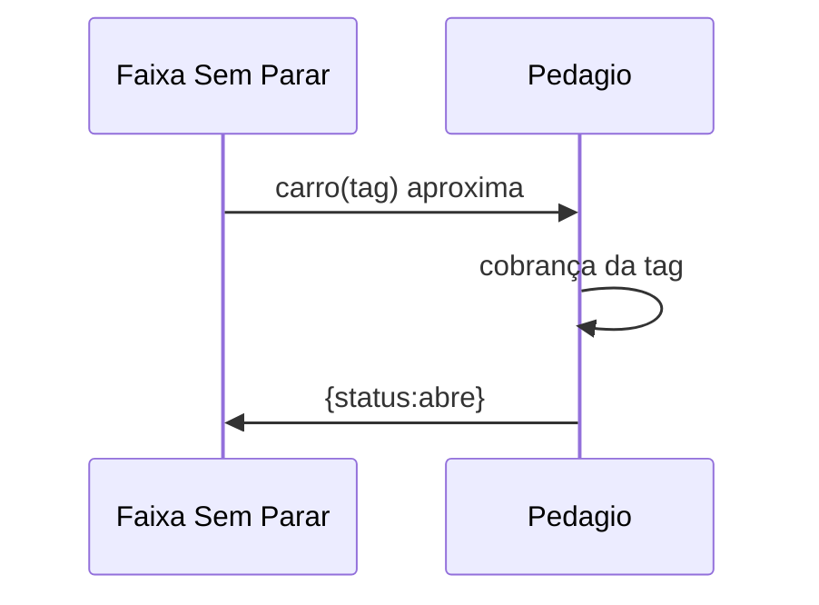

# Use-case 01: Carro transita na faixa sem-parar

Revisão: 2023-10-05

Visão geral:

# Funcionamento

O serviço aceitará requisições (HTTP/gRPC) que sinalizem que um carro se aproximou do pedágio e responderá com o status de abertura da cancela.

# Especificação técnica

### Entrada

A comunicação de entrada deverá fornecer os seguintes campos:

|campo|Tipo|Formato|Exemplo|
|-|-|-|-|
|`tag`|texto|livre, max 140 caracteres |J-12323LALJF-23|

### Saida

|campo|Tipo|Formato|Exemplo|
|-|-|-|-|
|`status`|texto| opções: `close`\|`open`|-|

### HTTP e GRPC

Os arquivos que definem o serviço gRPC e a especificação equivalente API ficarão nas pastas próprias.

